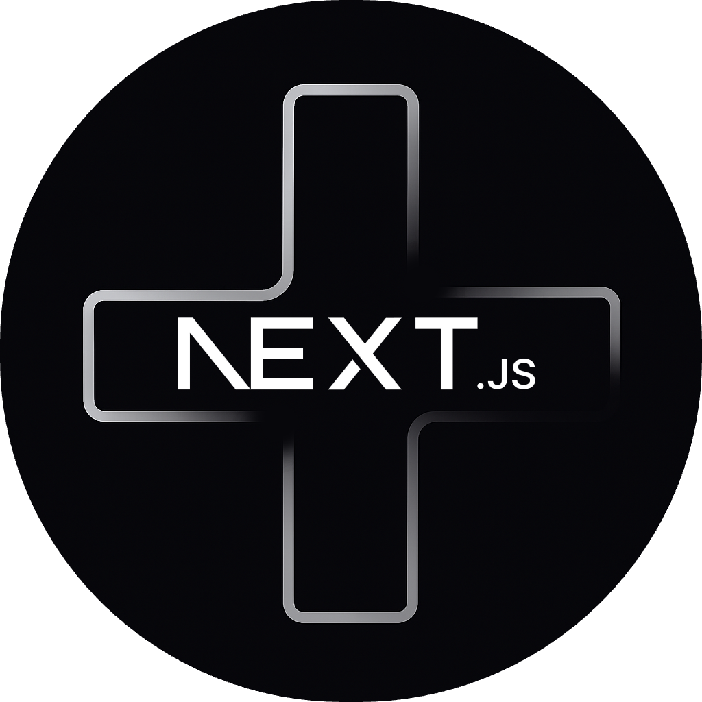

<table>
<tbody>
<td align="center">
 

  
  &nbsp;&nbsp;&nbsp;
  &nbsp;&nbsp;&nbsp;
  &nbsp;&nbsp;&nbsp;
  
  
  
</td>
</tbody>
</table>

 

  
<u><b>Next.js Plus</b></u>

  

## Features

- Launch a new Next.js project from the status bar (`Next.js` entry at the bottom-left corner).
- Guided prompts for the project name and destination folder, with additional questions only when you enable the matching “Prompt …” toggles.
- Runs `npx create-next-app@latest` with curated defaults (TypeScript, Tailwind, ESLint, App Router, no `src/`, no experimental features, Turbopack, no React Compiler, import alias `@/*`, npm).
- Streams scaffold progress to a dedicated VS Code output channel.
- Optionally open the generated project automatically in a fresh VS Code window.
- Optional default project location so you can skip the folder picker when desired.
- Optional shadcn/ui automation to initialize the library and install every component right after scaffolding.

---

## Settings

- `Default project location`
- `TypeScript` / `Prompt for TypeScript`
- `Tailwind CSS` / `Prompt for Tailwind CSS`
- `ESLint` / `Prompt for ESLint`
- `App Router` / `Prompt for App Router`
- `Create src/ directory` / `Prompt for src/ directory`
- `Experimental App features` / `Prompt for experimental App features`
- `Turbopack` / `Prompt for Turbopack`
- `React Compiler` / `Prompt for React Compiler`
- `Import alias` / `Prompt for import alias`
- `shadcn init` / `Prompt for shadcn init`
- `Install all shadcn components` / `Prompt for shadcn components`
- `Open in new window`

Every setting lives under **Next.js Plus Configuration** (`nextjsPlus.*`). Most map directly to a Create Next App flag; the default project location lets you skip the folder picker (set via the `Next.js Plus: Select Default Project Location` command) and the shadcn toggles let you automate `npx shadcn@latest init` and `npx shadcn@latest add --all`. When a “Prompt …” toggle is enabled, the stored default is ignored and you’re asked during project creation.

---

## Release Notes

### 1.0.5 — shadcn/ui Automation

- Added settings (and optional prompts) to run `npx shadcn@latest init` automatically after scaffolding.
- Added toggle to run `npx shadcn@latest add --all` to pull in every component.
- Updated docs and settings descriptions to highlight the shadcn workflow.

### 1.0.4 - Updated alignment

- Updated `StatusBarItem` alignment.

---

### 1.0.3 - Code cleanup

- Made code more readable and easier to understand.
- Removed unnecessary `.gitignore` items.

### 1.0.2 — Default Location Command

- Added command palette action (`Next.js Plus: Select Default Project Location`) to pick a default folder via native dialog.
- Updated settings description to highlight the command.
- Improved fallback messaging when the stored default folder is invalid.

### 1.0.1 — Branding & Docs

- Added logo.
- Updated `.gitignore`.
- Refreshed README.

### 1.0.0 — Initial Release

- Create Next.js project from the status bar with curated defaults.
- Configure defaults and per-run prompts for every Create Next App flag.
- Optionally skip opening the generated project in a new VS Code window.

---

**Enjoy!**
